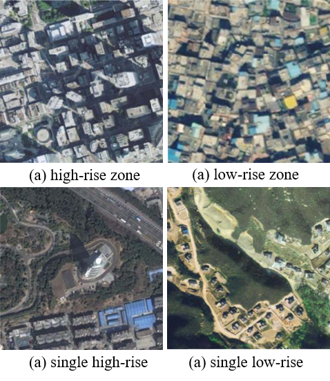

# The-Hainan-Building-Subclass-Dataset
## Abstract
As far as we know, few public datasets specifically for remote sensing building subclass segmentation are available. Thus, to push forward the development of this area, we construct a subclass dataset for buildings in Hainan Province, China. The Hainan dataset we presented compensates for the absence of building subclass segmentation datasets. We will continue to expand this dataset as the research progresses. Four building subclasses exist in this dataset: high-rise zone (HZ), low-rise zone (LZ), single high-rise (SH), single low-rise (SL), which are identified by experts from the Shanxi provincial mapping agency.

<figure>
  <text-align: center;>
  
</figcaption>
</figure>

## Dataset Description
The dataset contains 42 images with resolutions ranging from 0.8m to 2m per pixel, and sizes ranging from 2000$\times$2000 to 5000$\times$6000. We crop the images to size 512$\times$512 patches. This gives a total of 1348 image patches, divided into 70\% for training and 30\% for validation. That is, we got a training set with 944 cropped images and a validation set with 404 cropped images. The proportion of each category (ignoring background) is shown in the below table. The data are imbalanced, and the proportion of SL in the dataset is deficient. The reason is that the geographic distribution of images is concentrated in urban areas, where most low-rise buildings are clustered.

**Index of classes: HZ (1), LZ (2), SH (3), SL (4), background (255)**

|            | HZ            | LZ            | SH            | SL            |
| ---------- | :-----------: | :-----------: | :-----------: | :-----------: |
| Number(M)  | 7.622         | 15.291        | 11.389        | 1.310         |
| \%         | 21.10         | 42.92         | 32.36         | 3.62          |

## Data structure
```
Hainan 
 ├── complete
 │      ├── images 
 │      │      └── <imageID>.tif
 │      │      └── ...
 │      ├── labels
 │      │      └── <imageID>.tif
 │      │      └── ...
 │      ├── shps
 │      │      └── <imageID>.shp
 │      │      └── ...
 ├── crop
 │      ├── images 
 │      │      └── <imageID_cropID>.tif
 │      │      └── ...
 │      ├── labels
 │      │      └── <imageID_cropID>.tif
 │      │      └── ...
 └──────│
```

## Dataset Link
BaiduYun: [Link](https://pan.baidu.com/s/1B6elnh6Rl7LTMd8aBq1xQw) (password: z28f)

OneDrive: [Link](https://onedrive.live.com/?cid=1190207EDF3DE506&id=1190207EDF3DE506%211413&parId=root&o=OneUp)
